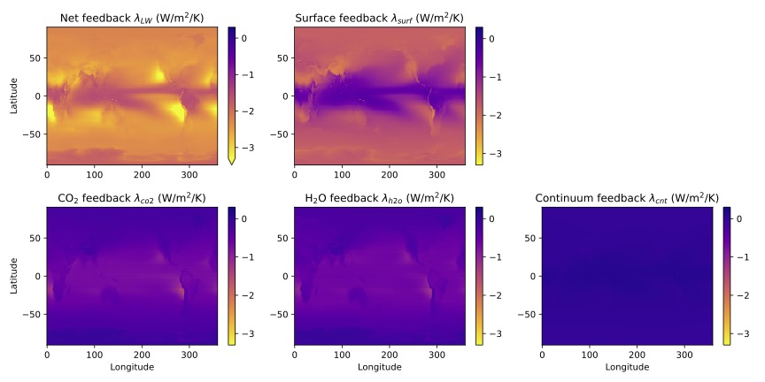

# Spectral feedback scripts

Scripts for computing the clearsky longwave spectral feedback expressions from Koll et al 2023. These scripts provide analytic approximations for the spectral terms that make up Earth's longwave clearsky feedback, and might or might not work well outside the parameter regime in which they were tested. Even for present-day Earth, they are only an approximation.

Reference:
- Koll, Jeevanjee, Lutsko (2023), An Analytic Model for the Clear-Sky Longwave Feedback, Journal of Atmospheric Sciences.
https://journals.ametsoc.org/view/journals/atsc/aop/JAS-D-22-0178.1/JAS-D-22-0178.1.xml

# How to use for simple calculations

*Software requirements: python, numpy, matplotlib*

1. compute analytic brightness temperatures:

cd $spectral_feedbacks

python -i plot_theory_brightness_temps.py

2. compute analytic spectral feedbacks as a function of surface temperature:

cd $spectral_feedbacks

python -i plot_theory_spectral_feedbacks.py

# How to use for advanced calculations

*Software requirements: the above, plus jupyter, xarray*

3. compute analytic spatial feedback maps using climate data (the example here uses ERA5 climatologies):

cd $spectral_feedbacks

jupyter notebook

-> open plot_theory_feedback_map.ipynb

-> run script

resulting output:

